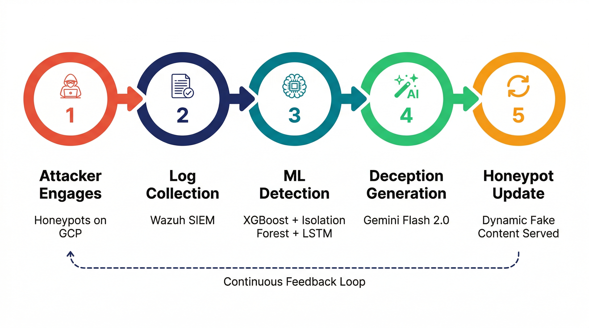

# DeceptIQ — HoneyCloud with AI Brain 🍯

> **Team Cyfer Trace** · Secure AI Software & Systems Hackathon 2026

**DeceptIQ** is an AI-powered honeypot deception platform that extends Wazuh SIEM with machine learning threat classification and Gemini-generated deception content — feeding everything back into your SIEM as native alerts, with zero workflow change for the SOC analyst.


---

## Quick Navigation

**📚 Conceptual Overview:**

- [Why DeceptIQ?](#why-deceptiq-use-cases) – Use cases and business value
- [System Architecture](#system-architecture) – High-level design
- [Methodology](#methodology) – 5-stage detection pipeline
- [Key Features](#key-features-at-a-glance) – Capabilities summary

**🏗️ Technical Deep Dives:**

- [ML Detection Engine](#ml-detection-engine) – Ensemble ML models
- [Deception Engine](#deception-engine--gemini-flash-20) – AI-powered lures
- [Live Dashboard](#live-dashboard--threat-intelligence-platform) – UI & visualization
- [STIX Reports](#stix-21-threat-intelligence-reports) – Threat sharing

**⚙️ Getting Started:**

- [Quick Start (5 min)](#quick-start-5-minutes) – Fastest way to run
- [Full Installation](#full-installation--configuration) – Production setup
- [Running](#running-the-system) – Operations guide

**📖 Reference:**

- [REST API](#rest-api-endpoints) – Endpoint documentation
- [Troubleshooting](#troubleshooting) – Common issues
- [Performance & Scalability](#performance--scalability) – Metrics & optimization
- [Project Structure](#project-structure) – File organization

---

## What DeceptIQ Does & Doesn't Do

### ✅ What It Does

- **Detects & classifies attacks** — ML models identify attack types and kill-chain stages
- **Enriches alerts** — Adds threat intel, geolocation, and behavioral scoring to Wazuh alerts
- **Extends existing SIEMs** — Plugs into Wazuh without replacing it
- **Generates deception** — AI creates contextual fake content to engage attackers
- **Exports threat reports** — STIX 2.1 bundles for sharing with peers
- **Validates detections** — Red team simulator tests your detection capabilities
- **Operates passively** — Honeypots don't feed into production networks
- **Works offline** — Deception engine has fallback (Ollama + static content)

### ❌ What It Doesn't Do

- **It's not a firewall** — doesn't block or redirect actual attacks
- **It doesn't replace Wazuh** — complements, not substitutes
- **It's not threat intelligence** — consumes public APIs (AbuseIPDB, OTX), doesn't generate original research
- **It doesn't scan networks** — only monitors honeypot engagement
- **It won't prevent APT groups** — deception is about engagement & data collection, not prevention
- **It's not SOAR** — no automated incident response/playhoods against production systems
- **It doesn't handle encrypted traffic** — honeypots speak plaintext protocols (SSH, HTTP, MySQL)
- **It requires Wazuh** — no support for ELK, Splunk, or other SIEMs (yet)

### ⚠️ Limitations & Caveats

| Limitation                        | Impact                                             | Mitigation                                                       |
| --------------------------------- | -------------------------------------------------- | ---------------------------------------------------------------- |
| **No encrypted protocol support** | Can't use HTTPS/SSH key-based auth in honeypots    | Use plaintext services (Flask over HTTP, Cowrie with weak creds) |
| **Wazuh-only integration**        | Won't work with ELK, Splunk, etc.                  | API-first architecture makes SIEM adapters possible              |
| **Cold start / few events**       | ML models need data to perform well                | Red Team simulator or existing honeypot logs for warm-start      |
| **Gemini API dependency**         | Deception generation fails if API down             | Local Ollama + static content fallback mitigates                 |
| **Threat intel rate limits**      | AbuseIPDB/OTX can throttle mid-demo                | Cache + tiered API plans; test with cached data                  |
| **Time-zone handling**            | Multi-geography deployments need UTC normalization | Pipeline already uses UTC; timezone in dashboard as needed       |
| **Multi-tenancy**                 | Single DeceptIQ instance = single threat model     | Deploy per-customer instances or extend schema                   |

---

Traditional honeypots are passive observers. They record that an attacker showed up, but they don't:

- Classify _what_ the attacker is doing or _how dangerous_ they are
- Adapt the environment to keep the attacker engaged longer
- Feed structured intelligence back into the SIEM where the SOC team already works
- Generate machine-readable threat reports for downstream sharing

Security teams end up with gigabytes of raw honeypot logs and no automated way to prioritize or act on them.

## The Solution

DeceptIQ sits between your honeypots and your SIEM. Every event that flows through Wazuh gets enriched with ML predictions, threat intelligence lookups, and — when severity crosses a threshold — AI-generated fake content served back to the attacker to waste their time and gather more intelligence.

The result feeds back into Wazuh as native alerts. Your SOC team sees `DeceptIQ: High severity brute force from 45.x.x.x` alongside their normal alerts — no new tools, no new dashboards required (though we built one anyway).

---

## ⚠️ Repository Note

**Code Implementation Removed** — This repository now contains the **architecture documents, design decisions, and conceptual framework** for DeceptIQ, but the Middleware implementation code and Red Team simulator have been removed.

**This documentation remains valuable for:**

- Understanding the complete DeceptIQ system design
- Learning the ML detection pipeline architecture
- Studying threat intelligence integration patterns
- Implementing similar systems in your own environment
- Reference by security teams evaluating the approach

For implementation details or archived code patterns, refer to `docs/DeceptIQ_Middleware_Architecture_Plan.md`.

---

## Key Features at a Glance

- 🎯 **Four parallel ML models** — ensemble approach scores threats across multiple dimensions
- 🧠 **BiLSTM Kill-Chain Classifier** — identifies attack stages (Recon → Exfiltration) in real-time
- 🤖 **AI-Powered Deception** — Gemini Flash 2.0 generates contextual fake content per attacker
- 🔄 **Bidirectional Wazuh Integration** — reads alerts, writes predictions back as native alerts
- 📊 **STIX 2.1 Threat Reports** — auto-export incidents for peer sharing and compliance
- 🎪 **Red Team Simulator** — validates detection capabilities with 3 attack modes
- 🌍 **Threat Intelligence Enrichment** — AbuseIPDB + AlienVault OTX with 1-hour caching
- 🗺️ **Geographic Attack Mapping** — live world map of attacker origins
- ⚡ **~60ms Detection Latency** — ML inference completes in real-time
- 🔧 **Hot-Pluggable Models** — swap trained models without restarting

---

## Why DeceptIQ? Use Cases

### 1. **SOC Enrichment for Existing Wazuh Deployments**

Organizations already running Wazuh can deploy DeceptIQ as a lightweight middleware to add ML threat classification without replacing their SIEM. All predictions feed back as native Wazuh alerts alongside existing rules.

### 2. **Threat Intelligence Gathering at Scale**

Capture sophisticated attacker behavior through honeypots, automatically enrich with AbuseIPDB & AlienVault OTX, and export as STIX 2.1 reports for sharing with peer organizations and threat intel platforms.

### 3. **Red Team Validation & Continuous Detection Testing**

Use the built-in Red Team simulator to validate that your Blue Team detection pipeline actually catches what it claims to catch. Run in demo, validate, or evasion mode to stress-test your ML models.

### 4. **Attacker Profiling & Kill-Chain Attribution**

Classify attacks across MITRE ATT&CK kill-chain stages (Recon, Initial Access, Persistence, etc.) using the BiLSTM attention model. Understand which phases attackers are most active and where to focus defenses.

### 5. **Deception-Driven THREAT ACTOR COLLECTION**

When an attacker reaches high severity threshold, serve AI-generated fake credentials, files, and configs tailored to their attack type. Observe how they react—do they take the bait? Move laterally? Exfiltrate? These behavioral signals feed back into the ML pipeline.

### 6. **Compliance & Incident Response**

Generate on-demand STIX 2.1 threat intelligence reports for any incident. Include full kill-chain reconstruction, threat actor sophistication scoring, and network indicators for downstream sharing.

---

## System Architecture


The platform has three layers:

**Deception Layer (GCP)** — A cluster of honeypots running in Docker containers:

- **Cowrie SSH** (port 22) — emulates a real SSH server, logs every keystroke and command
- **Flask Web Portal** (port 80/443) — a fake internal web application serving AI-generated content
- **HoneyDB / OpenCanary SQL** (port 3306) — fake MySQL database pre-loaded with plausible-looking data
- **Fake GCS Bucket** — lure cloud storage endpoint

**Wazuh SIEM** — Collects and normalises logs from all honeypots. DeceptIQ middleware runs on the same VM.

**DeceptIQ Middleware** — The AI brain: polls Wazuh's `alerts.json`, runs the ML pipeline, queries threat intel APIs, generates deceptive content via Gemini, and writes predictions back into Wazuh.

---

## Methodology



The pipeline runs in five stages on every new alert:

| Stage                       | What Happens                                                                       |
| --------------------------- | ---------------------------------------------------------------------------------- |
| **1. Attacker Engages**     | Hits Cowrie SSH, Flask web portal, or OpenCanary SQL on GCP                        |
| **2. Log Collection**       | Wazuh agent collects all logs, normalises and forwards to Wazuh Manager            |
| **3. ML Detection**         | XGBoost + Isolation Forest + BiLSTM classify the attack in ~60ms                   |
| **4. Deception Generation** | Gemini Flash 2.0 generates contextual fake content tailored to the attack type     |
| **5. Honeypot Update**      | Dynamic fake content is served; attack surface adapts via Docker container control |

The loop is continuous — every attacker action refines the session model and triggers fresh deception.

---

## ML Detection Engine

Four models run in parallel, each scoring a different dimension of the attack:

```
Event Arrives
    │
    ├── XGBoost (aws_model)       — "Is this a known attack pattern?"
    │   13 features: IP, ports, GeoIP, protocol, timestamp
    │   Weight: 0.35
    │
    ├── XGBoost (dionaea_model)   — "What network behaviour is this?"
    │   6 features: protocol, transport, connection type, ports
    │   Weight: 0.25
    │
    ├── Isolation Forest (CIC)    — "Is this session anomalous?"
    │   8 session-level aggregates: packet stats, unique IPs/ports/protocols
    │   Weight: 0.25
    │
    └── BiLSTM + Attention        — "What kill-chain stage?"
        6 features × 20-event sequences
        Classes: Exfiltration · Exploitation · Lateral · Recon · Scanning
        Weight: 0.15
    │
    ▼
Combined Severity Score → Deception Trigger (≥ 0.6)
```

The LSTM model is **hot-pluggable** — drop a new `.pt` file in and it activates on the next polling cycle without restarting anything.

---

## Deception Engine — Gemini Flash 2.0

When severity crosses 0.6, the deception engine activates. It calls Gemini Flash 2.0 with full attack context and gets back structured fake content:

```json
{
  "content_type": "credentials",
  "content": "<!-- DB: prod_customers user=dbadmin pass=Summer2024! -->",
  "mime_type": "text/html",
  "lure_tags": ["database", "admin", "credentials"],
  "fake_assets": [
    { "type": "credential", "value": "dbadmin:Summer2024!" },
    { "type": "file", "value": "/var/backup/db_dump_2026-01-15.sql.gz" }
  ]
}
```

The prompt is attack-type-aware — a brute force attempt gets fake SSH credentials, a SQL injection probe gets a believable SQL error with real-looking table names, a web crawler gets a fake `.env` file with fake AWS keys and tokens.

**Fallback chain:** Gemini → Ollama (local LLM) → static content pools. The system always serves _something_ deceptive.

---

## Threat Intelligence Enrichment

Every new source IP is enriched from two feeds:

- **AbuseIPDB** — confidence score (0–100), total historical reports, country, ISP
- **AlienVault OTX** — pulse count, associated campaign names, malware family tags

Results are cached in PostgreSQL for 1 hour to stay within API rate limits. The enriched data feeds the attacker profile, the combined severity score, and the STIX report.

---

---

## Live Dashboard & Threat Intelligence Platform

The real-time dashboard and reports hub provide multiple views into attack patterns, threat actor behavior, and ML predictions.

### Main Dashboard — Unified Threat Overview


The main threat dashboard displays:

- **Total Events Captured** — cumulative event count across all honeypots and time ranges
- **Active Sessions** — number of unique attacking IPs with active connections
- **Average Severity Score** — weighted ML threat classification (0–1.0 scale)
- **Deceptions Served** — count of AI-generated fake payloads deployed against attackers
- **Live Attack Map** — geographic distribution of attacker origins
- **Attack Breakdown** — pie chart of attack types (scanning, brute force, SQL injection, etc.)

### Dashboard with Attack Classification


High-level dashboard view showing total event counts and attack surface overview. All metrics update in real-time as new events arrive.

### Live Event Feed & ML Predictions Sidebar


**Left Panel — Live Event Stream:**

- Source IP and honeypot type (Cowrie SSH, Flask Web, OpenCanary SQL)
- Wazuh rule ID and attack type classification
- Severity score per event
- Timestamps and session grouping

**Right Panel — ML Prediction Tags:**

- Four parallel model outputs displayed as color-coded labels:
  - **AWS-XGBoost** — known attack pattern confidence
  - **CIC-IF** — anomaly score from Isolation Forest
  - **Dionaea-XGBoost** — network behavior classification
  - **LSTM** — kill-chain stage prediction (Recon, Initial Access, Exfiltration, etc.)
- Example: `Exfiltration: 0.80` indicates 80% confidence the current session activity matches exfiltration patterns

### Top Attackers & Active Sessions


Real-time ranking of:

- **Top Attackers** — source IPs ranked by combined threat score; shows event count and AbuseIPDB reputation
- **Active Sessions** — currently open sessions with last-seen timestamp and session duration
- **Deception Actions** — audit trail of every AI-generated fake response served to attackers, tagged with the model used (Gemini Flash, Ollama, or static fallback)

### Deception Actions Audit Log


Each deception action logged with:

- Session ID (grouped by attacker IP + 30-min window)
- Trigger condition (severity threshold crossed, specific attack type detected)
- Which GenAI model generated the content (Gemini Flash 2.0, Ollama local LLM, or static pool)
- Timestamp and payload summary
- This creates a full forensic audit trail for incident response

---

## STIX 2.1 Threat Intelligence Reports

### Session Report Selection View


All completed attacker sessions are available for on-demand STIX report generation. Sessions displayed with:

- Severity badge (Critical/High/Medium/Low)
- Attack type summary
- Event count and time range
- Threat actor sophistication estimate

### Generated STIX Report


Clicking a session generates a STIX 2.1 bundle including:

- **Threat Actor** — attacker profile with sophistication rating derived from ML severity and kill-chain stage
- **Indicator** — attacker IPv4 address with STIX pattern `[ipv4-addr:value = 'x.x.x.x']`
- **Attack Patterns** — one object per observed MITRE ATT&CK technique, with external references
- **Observed Data** — full event timeline and behavioral summary
- **Relationships** — linking actor → indicator → attack patterns → targeted systems

Reports downloadable as `deceptiq_stix_{ip}_{session}.json` for sharing with peer SOCs, threat intel platforms, or external organizations.

### Wazuh Integration Dashboard


DeceptIQ feeds predictions back into Wazuh as native alerts using a custom decoder + rule set. SOC analysts see `DeceptIQ: High severity attack detected` entries in the Wazuh dashboard alongside all other alerts.

### Wazuh Discovery & Column Format View


Raw alert exploration in Wazuh's Discovery interface showing DeceptIQ prediction fields:

- Source IP and port information
- Attack classification and severity
- Threat intel enrichment (AbuseIPDB score, OTX pulse count)
- Related system events (CVE matches, file changes, command execution)

## Wazuh Native Integration

**Custom Wazuh rules:**

| Rule ID | Level | Trigger                    |
| ------- | ----- | -------------------------- |
| 100101  | 12    | Severity score ≥ 0.7       |
| 100102  | 8     | Severity score 0.4–0.6     |
| 100103  | 13    | AbuseIPDB score ≥ 70       |
| 100104  | 6     | Deception action triggered |

---

## Red Team Simulation & Testing

### Why Red Team?

DeceptIQ includes a **continuous Red Team simulator** to:

1. **Validate Detection Capabilities** — every Blue Team detection pipeline claim has a corresponding Red Team attack that triggers it
2. **Test Against Evasion Techniques** — simulate sophisticated adversaries using MITRE ATT&CK kill-chain stages
3. **Feed Fresh Training Data** — continuous attack simulation keeps ML models current and prevents model drift
4. **Stress-Test the System** — prove the middleware handles load, false positives, and cascading alerts

### Three Simulation Modes (Architectural Design)

The Red Team simulator would support three operating modes:

**Mode 1: Demo** — Predictable, timed attacks for live presentation

- Follows a scripted 4-stage attack sequence with visible delays
- Designed to show all detection pipeline stages
- Good for live demos and validation

**Mode 2: Validate** — Aggressive, tests all detection capabilities

- Rapid-fire attacks across multiple vectors
- Tests every ML model and rule
- Stresses the system for performance benchmarking

**Mode 3: Evasion** — Stealthy, slow attacks that find blind spots

- Low-and-slow attack patterns
- Tests timeout behavior and session management
- Identifies weaknesses in detection thresholds

Refer to `docs/DeceptIQ_Red_Team_Strategy.md` for the complete attack framework and MITRE ATT&CK mappings.

### Attack Stages (MITRE ATT&CK Mapped)

| Stage                                          | Techniques                                                   | What Gets Tested                                           |
| ---------------------------------------------- | ------------------------------------------------------------ | ---------------------------------------------------------- |
| **Reconnaissance (T1595, T1592, T1590)**       | Port scanning, Service fingerprinting, Web enumeration       | Wazuh scanning detection, Isolation Forest anomaly scoring |
| **Initial Access (T1110, T1190, T1078)**       | SSH brute force, SQL injection, Default credentials          | Signature-based detection, Behavioral modeling             |
| **Persistence (T1098, T1197, T1547)**          | Account creation, Cron jobs, SSH key planting                | Session persistence, Multi-event correlation               |
| **Privilege Escalation (T1134, T1548, T1611)** | Sudo abuse, Kernel exploit simulation                        | Privilege change detection                                 |
| **Defense Evasion (T1197, T1562, T1070)**      | Log tampering, Process hiding, Timestamp manipulation        | Integrity checking, Anomaly detection                      |
| **Credential Access (T1110, T1187, T1040)**    | Brute force, Phishing simulation, Network sniffing           | Behavioral profiling, Credential flow tracking             |
| **Discovery (T1087, T1526, T1538)**            | Account enumeration, Cloud service enumeration               | Unusual query pattern detection                            |
| **Lateral Movement (T1570, T1021, T1570)**     | SSH pivoting, Lateral network scanning                       | Session correlation, Network flow analysis                 |
| **Collection (T1123, T1119, T1115)**           | Audio capture simulation, Clipboard data, Screen capture     | Data exfiltration detection                                |
| **Exfiltration (T1048, T1041, T1020)**         | DNS exfiltration, C2 callbacks, Proxy tunneling              | Network flow anomaly, Protocol deviation                   |
| **Command & Control (T1071, T1092, T1008)**    | Standard application layer, DNS tunneling, Fallback channels | Persistence mechanism detection                            |

### Red Team Attack Surfaces

| Surface    | Honeypot       | Port(s)  | What Attackers See                                                     |
| ---------- | -------------- | -------- | ---------------------------------------------------------------------- |
| SSH Access | Cowrie         | 22, 2222 | Fake Linux filesystem, credentials, SSH keys hidden in authorized_keys |
| Web Portal | Flask          | 80, 443  | Client dashboard, admin panels, API endpoints, backup files            |
| Database   | OpenCanary SQL | 3306     | MySQL instance with fake client data, vulnerability reports            |

### Attack Progression Example (Demo Mode)

```
12:00:00 - Attacker discovers open ports (22, 80, 443, 3306) via SYN scan
           ↓ Wazuh triggers: scanning_detected
           ↓ XGBoost: 0.12 (low—just scanning)

12:00:15 - Attacker fingerprints services, gets Cowrie SSH banner
           ↓ Wazuh triggers: service_fingerprinting
           ↓ Isolation Forest: anomaly=true (rapid connection pattern)

12:00:45 - Attacker launches SSH brute force with common credentials
           ↓ Wazuh triggers: brute_force_attempt
           ↓ XGBoost: 0.45 (medium—known attack pattern)

12:01:30 - Attacker lands shell with planted weak credential
           ↓ Session created in PostgreSQL session_manager
           ↓ BiLSTM: initial_access=0.89

12:02:00 - Attacker probes filesystem, discovers /var/backups/
           ↓ Deception engine triggers (severity > 0.6)
           ↓ Gemini Flash generates fake /var/backups/.backup.sql.gz

12:02:15 - Attacker downloads fake SQL dump
           ↓ LSTM: exfiltration=0.92
           ↓ Severity score: 0.78 (HIGH)
           ↓ STIX report generated, logged for incident response
```

---

---

## Technology Stack

| Component      | Technology                                             |
| -------------- | ------------------------------------------------------ |
| Honeypots      | Cowrie, OpenCanary, Custom Flask app                   |
| SIEM           | Wazuh (bidirectional integration)                      |
| Middleware     | Python 3.12, Flask, psycopg2                           |
| Database       | PostgreSQL (Aiven cloud)                               |
| ML Models      | XGBoost, Scikit-learn Isolation Forest, PyTorch BiLSTM |
| GenAI          | Gemini Flash 2.0 (google-genai SDK)                    |
| Threat Intel   | AbuseIPDB API, AlienVault OTX API                      |
| GeoIP          | MaxMind GeoLite2-City                                  |
| Threat Sharing | STIX 2.1                                               |
| Infrastructure | Google Cloud Platform, Docker                          |
| Dashboard      | HTML/CSS/JS (polling REST API)                         |

---

## How the Bidirectional Wazuh Loop Works

```
Wazuh alerts.json          DeceptIQ Middleware          Wazuh (predictions back)
─────────────────          ───────────────────          ────────────────────────
New alert written ──────►  Poll every 5 seconds
                           Parse + normalize alert
                           Session manager (30 min TTL)
                           Feature engineering (4 schemas)
                           ML pipeline (XGB + IF + LSTM)
                           Threat intel enrichment
                           Deception content (if sev≥0.6)
                           Store all in PostgreSQL
                           Write prediction JSON line ──► /var/log/deceptiq/predictions.json
                                                          Wazuh agent picks up
                                                          Custom decoder + rules
                                                          Native Wazuh alert created ◄──
```

This means DeceptIQ works as a **SIEM plugin**, not a replacement. Any organization already running Wazuh can bolt this on.

---

## Database Schema

Seven PostgreSQL tables form the backbone of the platform:

```
events            — raw Wazuh alert records (JSONB raw_log)
sessions          — attacker sessions grouped by IP + 30-min timeout
predictions       — ML model outputs per event
threat_intel      — AbuseIPDB + OTX cache (1-hour TTL)
deception_actions — audit log of every fake response served
attacker_profiles — aggregated attacker intelligence
stix_reports      — generated STIX 2.1 bundles (stored as JSONB)
```

---

## Architecture & Concepts Guide

> **Note:** This section describes the DeceptIQ system design and how its components interact. The implementation code has been removed from this repository. Refer to the `docs/` folder for archived implementation details.

### System Components Overview

The DeceptIQ architecture consists of three layers working together:

**1. Deception Layer (Honeypots)**

- Services: Cowrie SSH, Flask Web Portal, OpenCanary SQL, GCS bucket
- Location: Isolated infrastructure (Google Cloud Platform)
- Purpose: Collect attacker interactions for analysis

**2. SIEM Integration (Wazuh)**

- Collects and normalizes logs from all honeypots
- Stores them in `alerts.json` for processing
- Acts as the single source of truth for alert data

**3. Intelligence Layer (Middleware)**

- Polls Wazuh alerts every 5 seconds
- Runs ML pipeline (XGBoost + Isolation Forest + BiLSTM)
- Enriches with threat intelligence (AbuseIPDB, AlienVault OTX)
- Generates deceptive content via Gemini Flash 2.0
- Writes predictions back to Wazuh as native alerts
- Maintains PostgreSQL database for sessions, predictions, profiles

### Data Flow

```
Attacker → Honeypots → Wazuh alerts.json → DeceptIQ Pipeline → Predictions → Wazuh Alerts
                                      ↓
                          PostgreSQL (events, sessions,
                          predictions, threat_intel,
                          deception_actions, profiles,
                          stix_reports)
```

### Implementation Reference

To implement DeceptIQ, you would need:

- **Python 3.10+** with Flask for API server
- **PostgreSQL 13+** for data persistence
- **ML libraries:** XGBoost, Scikit-learn, PyTorch (for BiLSTM)
- **APIs:** Google Gemini, AbuseIPDB, AlienVault OTX
- **GeoIP:** MaxMind GeoLite2-City database

The implementation would follow the patterns described in the [System Architecture](#system-architecture) and [ML Detection Engine](#ml-detection-engine) sections.

See `docs/DeceptIQ_Middleware_Architecture_Plan.md` for archived implementation specifications.

### REST API Endpoints

The Flask middleware exposes these endpoints (used by the dashboard):

**Dashboard Data:**

```bash
GET  /api/events           # All events (paginated, optional ?limit=100&offset=0)
GET  /api/sessions         # Active sessions with threat scores
GET  /api/predictions      # Latest ML predictions
GET  /api/attackers        # Top attackers ranked by severity
GET  /api/stats            # Dashboard KPIs (total events, active sessions, avg severity)
GET  /api/deceptions       # Deception actions audit log
```

**STIX & Threat Intel:**

```bash
GET  /api/sessions/<session_id>/stix      # Generate STIX 2.1 report for session
GET  /api/threat_intel/<ip>               # AbuseIPDB + OTX enrichment for IP
GET  /api/attacker_profile/<ip>           # Aggregated profile for attacking IP
```

**Configuration & Health:**

```bash
GET  /health               # Service health check
GET  /api/config           # Current ML model weights + thresholds
POST /api/config           # Update thresholds (requires auth in prod)
```

**Example request:**

```bash
curl http://localhost:5000/api/events?limit=10 | jq '.'
curl http://localhost:5000/api/sessions | jq '.[] | select(.severity_score > 0.7)'
curl http://localhost:5000/api/threat_intel/45.128.99.23
```

---

---

## Implementation Guide (Reference)

> **CodeBase Removed:** The actual middleware implementation has been removed. This section describes what would be required to implement DeceptIQ.

### Stack Requirements

### Database Design (PostgreSQL)

DeceptIQ would use PostgreSQL with 7 tables:

```sql
-- Events: Raw Wazuh alerts with JSONB raw_log
CREATE TABLE events (
  id SERIAL PRIMARY KEY,
  timestamp TIMESTAMP,
  source_ip INET,
  raw_log JSONB
);

-- Sessions: Attacker sessions grouped by IP + 30-min timeout
CREATE TABLE sessions (
  id UUID PRIMARY KEY,
  source_ip INET,
  first_seen TIMESTAMP,
  last_seen TIMESTAMP
);

-- Predictions: ML model outputs per event
CREATE TABLE predictions (
  id SERIAL PRIMARY KEY,
  event_id INTEGER REFERENCES events,
  xgboost_score FLOAT,
  isolation_forest_anomaly BOOLEAN,
  lstm_stage VARCHAR(50),
  severity_score FLOAT
);

-- Threat Intel: AbuseIPDB + OTX cache (1-hour TTL)
CREATE TABLE threat_intel (
  source_ip INET PRIMARY KEY,
  abuseipdb_score INT,
  abuseipdb_reports INT,
  otx_pulse_count INT,
  cached_at TIMESTAMP
);

-- Deception Actions: Audit log of AI-generated responses
CREATE TABLE deception_actions (
  id SERIAL PRIMARY KEY,
  session_id UUID REFERENCES sessions,
  content_type VARCHAR(50),
  model_used VARCHAR(50),
  triggered_at TIMESTAMP
);

-- Attacker Profiles: Aggregated intelligence
CREATE TABLE attacker_profiles (
  source_ip INET PRIMARY KEY,
  event_count INT,
  avg_severity FLOAT,
  kill_chain_stage VARCHAR(50)
);

-- STIX Reports: Generated threat reports (stored as JSONB)
CREATE TABLE stix_reports (
  id UUID PRIMARY KEY,
  session_id UUID REFERENCES sessions,
  stix_bundle JSONB,
  generated_at TIMESTAMP
);
```

For real deployment, consider:

- Indexing on `source_ip` and `timestamp` for query performance
- Table partitioning by date for retention management
- Replication for high availability

### Wazuh Integration (Architecture)

DeceptIQ would integrate with Wazuh via:

1. **Custom Decoder:** Parse DeceptIQ JSON predictions into structured alerts
   - Read from `/var/log/deceptiq/predictions.json`
   - Extract fields: source_ip, severity_score, attack_type, lstm_stage

2. **Custom Rules:** Translate predictions to Wazuh alert levels
   - Rule 100101: `severity_score ≥ 0.7` → Level 12 (CRITICAL)
   - Rule 100102: `severity_score 0.4–0.6` → Level 8 (HIGH)
   - Rule 100103: `abuseipdb_score ≥ 70` → Level 13 (CRITICAL)
   - Rule 100104: Deception action triggered → Level 6

3. **Localfile Monitor:** Point Wazuh at DeceptIQ predictions log

   ```xml
   <localfile>
     <log_format>json</log_format>
     <location>/var/log/deceptiq/predictions.json</location>
     <label key="source">deceptiq</label>
   </localfile>
   ```

4. **Data Flow:** Wazuh alerts → DeceptIQ (read) → ML processing → Predictions → Wazuh (write) → Native Wazuh alerts

See `docs/` for archived decoder and rules XML files.

### External API Dependencies

**Gemini Flash 2.0 (Required)**

- Purpose: Generate contextual fake content for deception
- Get Key: https://ai.google.dev/
- Rate Limit: Tier-dependent (free tier: 60 requests/min)
- Fallback: Local Ollama LLM or static content pool

**AbuseIPDB (Recommended)**

- Purpose: IP reputation scoring and historical abuse reports
- Get Key: https://www.abuseipdb.com/register
- Rate Limit: 15 requests/24hrs (free), upgrade for higher
- Cache Strategy: 1-hour TTL in PostgreSQL to stay under limits

**AlienVault OTX (Optional)**

- Purpose: Campaign associations, malware family tags
- Get Key: https://otx.alienvault.com/
- Rate Limit: 50 requests/min (free tier)
- Data: Pulse counts, related CVEs

**MaxMind GeoLite2-City (Optional)**

- Purpose: Geographic attribution of attackers
- Get: https://www.maxmind.com/en/geolite2 (free account)
- Format: MMD binary database file
- Update Frequency: Weekly

---

## Operational Concepts (Reference)

### Monitoring Points

When running DeceptIQ, you would monitor:

**Middleware Health:**

- Flask API endpoint responsiveness (`/health` endpoint)
- Wazuh alerts.json polling timing (5-second intervals)
- ML model inference latency (~60ms per event)

**Database Health:**

- PostgreSQL query performance (event insertion rate)
- Session table cleanup (30-minute TTL expiration)
- Threat intel cache hit rate (1-hour TTL)

**API Dependencies:**

- Gemini API availability and latency
- AbuseIPDB rate limit consumption
- OTX quota remaining

**Dashboard Metrics:**

- Active attacker sessions and trends
- Average severity score over time windows
- Deception actions count and model usage distribution
- Geographic spread of attacks

### Dashboard Interaction

The dashboard would poll the Flask API every 5 seconds to display:

- Live event feed with ML predictions from all 4 models
- Real-time geographic map of attacker origins
- Top attackers ranked by threat score
- Active sessions with session duration
- Audit log of all deception actions served
- On-demand STIX report generation

---

## Implementation Troubleshooting Guide (Reference)

> **For Implementers:** If you rebuild DeceptIQ, these are common issues you might encounter based on the architecture design:

### Common Implementation Challenges

**Wazuh Integration**

- Custom decoder must be loaded before rules are applied
- JSON format of predictions must exactly match decoder schema
- Test decoder parsing with sample data before production

**ML Model Issues**

- BiLSTM requires 20-event sequences; cold start may have lower confidence
- XGBoost models trained on imbalanced attack data need rebalancing
- Feature engineering schema must match training data exactly

**Threat Intel API Limits**

- Implement 1-hour caching to stay under rate limits
- AbuseIPDB free tier: 15 requests/24hrs; upgrade for higher
- OTX free tier: 50 requests/min; adjust polling accordingly

**Database Performance**

- Add indexes on `source_ip` and `timestamp` before deployment
- Partition predictions table by date for faster queries
- Monitor PostgreSQL connection pool for leaks

**Dashboard Responsiveness**

- If API responses > 500ms optimize database queries
- Implement pagination for large result sets
- Consider Redis caching for hot data

Refer to `docs/DeceptIQ_Middleware_Architecture_Plan.md` for archived implementation specifications.

---

## Performance & Scalability

### Latency & Throughput

| Metric                     | Value     | Notes                                     |
| -------------------------- | --------- | ----------------------------------------- |
| **ML Detection Latency**   | ~60ms     | XGBoost + IF + LSTM ensemble per event    |
| **Alert Poll Interval**    | 5 seconds | Configurable, tested down to 1 second     |
| **Max Events/Second**      | 100+      | With 4-core VM, PostgreSQL tuned          |
| **STIX Report Generation** | ~500ms    | Per-session, cached after first gen       |
| **Threat Intel Lookup**    | ~200ms    | API call + DB cache (1-hour TTL)          |
| **Feature Engineering**    | ~30ms     | 4 model schemas in parallel               |
| **Deception Content Gen**  | ~1.2s     | Gemini API, with Ollama fallback (~300ms) |

### Resource Requirements

**Minimum (Development/Testing):**

- **CPU:** 2 cores
- **RAM:** 4 GB
- **Disk:** 20 GB (PostgreSQL + models)
- **Network:** 10 Mbps

**Recommended (Production):**

- **CPU:** 4-8 cores
- **RAM:** 16 GB (active session cache)
- **Disk:** 100+ GB SSD (event volume grows)
- **Network:** 100 Mbps (multi-site threat intel)

### Scaling Considerations

**Vertical Scaling (Recommended for <10K events/day):**

- Add CPU cores to middleware VM
- Increase PostgreSQL `shared_buffers` to 25% of RAM
- Deploy multiple model inference processes

**Horizontal Scaling (For >10K events/day):**

- **Multiple middleware instances** behind a load balancer
- **Shared PostgreSQL** (Aiven, RDS, or self-managed replication)
- **Distributed session cache** (Redis) for consistency across instances
- **Async task queue** (Celery) for deception generation

**Database Optimization:**

```sql
-- Index events for faster queries
CREATE INDEX idx_events_src_ip ON events(source_ip);
CREATE INDEX idx_events_timestamp ON events(timestamp DESC);
CREATE INDEX idx_sessions_ttl ON sessions(last_seen);

-- Partition predictions by date for retention
CREATE TABLE predictions_2026_q2 PARTITION OF predictions
  FOR VALUES FROM ('2026-04-01') TO ('2026-07-01');
```

---

```
GOA-Hackathon/DeceptIQ/ (Repository Contents)
├── README.md                             # This file
│
├── docs/
│   ├── DeceptIQ_Middleware_Architecture_Plan.md      # Archived implementation details
│   └── DeceptIQ_Red_Team_Strategy.md                 # Archived attack simulation framework
│   └── deceptiq_stix_223_228_129_135_sess_223.json   # Sample STIX 2.1 report
│
└── images/
    ├── _Cyfer-Trace-DeceptIQ.png         # Technical approach diagram
    ├── System-Architecture.png            # Full system architecture
    ├── Methodology-flow.png              # 5-stage detection pipeline
    └── Screenshot*.png                   # 20+ dashboard UI screenshots
```

**Code Removed** — The following components have been removed from this repository:

- `Middleware/` — Flask middleware application (app.py, services, config)
- `red_team_sim.py` — Red Team simulator (3 attack modes)

Both are documented in the `docs/` folder for reference implementation.

---

## Key Design Decisions

**Why poll alerts.json instead of using Wazuh API?**
Direct file reading is faster (no auth overhead), works without API credentials, and survives Wazuh API restarts. The middleware tracks file position and handles log rotation automatically.

**Why PostgreSQL and not a time-series DB?**
Session management requires relational joins (events ↔ sessions ↔ predictions ↔ profiles). PostgreSQL's JSONB handles unstructured raw log data while the relational schema handles structured queries. One DB, full flexibility.

**Why BiLSTM for kill-chain detection?**
Attackers don't act in single events — they follow sequences. A bidirectional LSTM with attention reads sessions as temporal sequences (up to 20 events) and identifies where in the kill-chain (Recon → Scanning → Exploitation → Lateral → Exfiltration) the attacker currently is. This is information no per-event model can provide.

**Why Gemini Flash 2.0 over a rules-based template engine?**
Templates produce the same fake content every time. A sufficiently sophisticated attacker would notice. Gemini generates contextually-aware, varied content that adapts to what the attacker has already done in the session — making the deception more convincing and the engagement longer.

---

## Team Cyfer Trace

Built in 24 hours for the **Secure AI Software & Systems Hackathon 2026**.

---

_DeceptIQ — Making every attack a learning opportunity._

```

```
